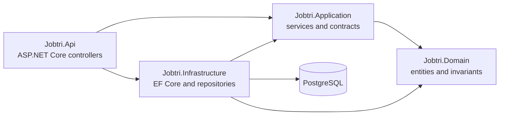

# Jobtri Architecture

## Scope and source of truth

This document describes the architecture currently visible in the repository. The source-of-truth order is:

1. Current repository code and configuration
2. Latest approved architectural decisions
3. Existing documentation as historical reference only

Planned capabilities are labelled explicitly and are not presented as implemented. Code is authoritative for current behavior; approved decisions govern intended behavior. A gap between the two does not supersede an approved decision.

## Project overview

Jobtri is a .NET job-search decision-support backend. Its current code provides a small API for managing companies, company sources, and jobs. The adopted product direction permits direct ATS / official company sources and job boards, with official ATS/company sources preferred when available. Generic scraping is not the primary acquisition strategy. The initial user is the project owner or another developer/user running Jobtri from GitHub.

The MVP uses manually entered job-search and filtering criteria. CV parsing and CV-based matching are later enhancements after the acquisition/filtering workflow is validated. SaaS architecture, multi-tenancy, complex user management, AI analysis, auto-apply, and advanced learning are not MVP prerequisites. SaaS may be considered later if the workflow proves useful. Human review remains required before applying, and mass auto-apply remains prohibited.

## Current architecture

Jobtri is organized as a four-project layered monolith with clean boundaries:



The API composes application services and infrastructure registration in `Program.cs`. Application services depend on persistence interfaces. Infrastructure implements those interfaces using Entity Framework Core and PostgreSQL. Domain entities do not depend on ASP.NET Core or EF Core.

## Layer responsibilities

### `Jobtri.Domain`

Current contents:

- `Company`, with name, website, and enabled state.
- `CompanySource`, with company association, careers URL, ATS type, optional ATS identifier, and enabled state.
- `Job`, with source identity, title, URL, optional location and description, posting date, and first/last-seen timestamps.
- `enAtsType` for `Unknown`, `Greenhouse`, `Lever`, `SmartRecruiters`, and `SuccessFactors`.
- `Guard.ValidHttpUrl` and entity-level validation.

The entities enforce basic invariants such as non-empty names and HTTP/HTTPS URLs.

### `Jobtri.Application`

Current contents:

- `CompanyService` for company creation, retrieval, enable/disable, and website updates.
- `CompanySourceService` for source creation, retrieval, and enable/disable.
- `JobService` for job creation and retrieval.
- Persistence interfaces for companies, company sources, and jobs.
- `IAtsConnector`, which is currently only an abstraction and has no implementation in the repository.
- Dependency-injection registration for the application services.

### `Jobtri.Infrastructure`

Current contents:

- `JobtriDbContext`.
- Fluent configurations for the three current entities.
- PostgreSQL provider registration through Npgsql in the API composition root.
- Repository implementations for the application persistence interfaces.
- One initial EF Core migration.

### `Jobtri.Api`

Current contents:

- `CompaniesController`.
- `CompanySourcesController`.
- `JobsController`.
- Configuration and dependency-injection composition in `Program.cs`.
- Swagger/OpenAPI middleware enabled in Development.

## Dependency flow

The project references are:

```text
Jobtri.Api
├── Jobtri.Application
└── Jobtri.Infrastructure
    ├── Jobtri.Application
    └── Jobtri.Domain

Jobtri.Application
└── Jobtri.Domain
```

The unit-test project references Domain and Application. The integration-test project references Api and Infrastructure.

## Main components and data flow

For a current create request:

```text
HTTP request
  -> controller action
  -> application service
  -> domain entity constructor or method
  -> repository
  -> JobtriDbContext
  -> PostgreSQL
```

Reads follow the reverse path and return domain entities directly from controllers. DTO request/response models are not currently used.

## Adopted MVP pipeline — implementation pending

The intended acquisition flow follows [D017](JOBTRI_DECISIONS.md#d017--filter-before-main-persistence):

```text
Acquire jobs
→ minimal normalization required for filtering
→ deduplication where applicable
→ hard/manual filters
→ persist relevant jobs to the main job store
```

Initial hard filters are country, language, contract type, domain / target role, and required experience. Criteria are entered manually; CV parsing or CV-based matching is not needed to begin filtering.

Only relevant jobs should enter the main normalized Jobs store. Future temporary processing or raw-data staging must be identified separately from main persistence. This decision does not introduce a staging table, database, or retention policy.

**Current implementation gap:** [JobService.CreateAsync](../src/Jobtri.Application/Jobs/JobService.cs) constructs a `Job`, calls `AddAsync`, and then `SaveChangesAsync`. It does not apply these search criteria. Entity validation and the existing unique index do not implement the adopted acquisition/filtering pipeline.

**Needs confirmation:** Missing-value handling for filters, specific source integrations, and any future staging design.

## Adopted coding conventions

- Use `int` IDs unless scale genuinely requires otherwise.
- Enum type names use the `en` prefix.
- Keep method and constructor parameter lists on one line when practical.
- Keep the architecture intentionally simple; avoid unnecessary patterns and abstractions.

These conventions describe approved direction without claiming universal formatting compliance in current code.

## Current technical decisions visible in code

- .NET 10 and C# are used for all projects.
- ASP.NET Core is the HTTP framework.
- PostgreSQL is the configured database from the beginning.
- EF Core with Npgsql is the persistence technology.
- The solution uses feature-oriented application services instead of MediatR or CQRS.
- Persistence contracts live in Application and implementations live in Infrastructure.
- `int` primary keys are used.
- Enum names use the existing `en` prefix convention.
- ATS integration is represented by an application abstraction, but connector implementations are future work.
- Human review and no mass auto-apply are adopted product constraints; no automated application workflow exists in the current code.

## Planned architecture extensions

The next MVP implementation is the adopted manual-criteria acquisition/filtering pipeline above. Broader normalization, cross-source deduplication, deterministic scoring, company discovery, additional source integrations, application tracking, analytics, CV parsing/matching, and AI-assisted analysis remain future work. They must not be described as implemented or all required for the initial MVP. See [Roadmap](JOBTRI_ROADMAP.md).
